# Probabilistic Models of Visual Cortex - Homework 1

## Feitong Yang

## Department of Psychological and Brain Sciences

# Question 0. Visual Illusions.
Visual illusions teach us about the assumptions that the brain makes when interpreting images. These assumptions are often correct but occasionally wrong, as shown by the illusions. Write a few (two or three) sentences explaining each of the illusions below. Which ones of them involve low-, mid-, or high-level vision? Note that all these illusions are
discussed in the Early Vision chapter by Yuille and Kersten.

1. Stereokinetic Effect (SKE)
    - Link: http://www.michaelbach.de/ot/mot-ske/index.html
    - Description and Explanation: 
        1. A specific figure, which has circles of different sizes attached to one tangential point, can lead to a 3-D perception of a cone, if the figure keeps rotating. Because of the rotation, the different areas of circles are interpreted as a depth-cue, thus a 3-D cone stands out. 
        2. Carefully monitoring the eyes, you will find your eyes are actually follow the rotation of the circle and almost always focus on the most inner circle. If you use mouse cursor as a marker to fixate your eyes at one single location, inside of outside of the circle, the 3-D perception becomes weak or even disappear. 
    - This involves **mid-level** vision because we perceives 3-D geometry structures from the motion.
2. Motion Binding
    - Link: http://www.michaelbach.de/ot/mot-motionBinding/index.html
    - Description and Explanation:
        1. two pairs of moving lines becomes a holistic motion of a diamond, when the ending points of the lines are covered by occluders. 
        2. When there is no occluders, the motion signal is analyzed locally, thus each line's motion direction and speed is determined by local analysis. However, because the two lines in diagonal location have the same motion signal, the are grouped together by the Gestalt rule.
        3. When the ending points of all lines are occluded, local motion analysis gives way to a global grouping interpretation, because now it is hard to know whether lines are moving independently or dependently. Given the frame by frame coherent moving patterns of four lines, which are coincidentally satisfy a coherent moving pattern of a diamond, the perceptual intepretation becomes a moving diamond whose four lines move dependently. 
    - This involves **the interaction between low-level and mid-level** vision because we perceive local motion when no occluders are present, but we perceive a square, a geometrical surface, moving when occluders are presented. 
3. Adelson’s  “Checker-shadow illusion”
    - Link: http://www.michaelbach.de/ot/lum-adelsonCheckShadow/index.html
    - Description and Explanation:
        1. two equal-luminance squares on the checkboard, under the shadow of a cylinder, result in dramatically different gray-level perception, with one looks white and the other looks black. When these two squares are segregated from the context, they are perceived with the same gray-level.
        2. Visual system unconsciously judges the lighting conditions and interpret physical world based on the hypothesis of lighting and shadowing. In the figure, the square A was thought to be under the normal lighting condition whereas the square B was thought to be under the shadow. Thus, the gray-level of the square B is corrected by taking the "shadow" into account, and visual perception of it becomes a white square. 
        3. When occluders are used to segregate squares A and B, visual system thinks that they are under the same lighting conditions, so there is no correction for either of them, and they are perceived as the same gray-level.
    - This involves **mid-level** vision because the illusion depends on the observer's interpretation of lighting and shadowing condition
4. Biological Motion
    - Link: http://www.michaelbach.de/ot/mot-biomot/index.html
    - Description and Explanation:
        1. A set of moving dots is perceived as a coherent motion of a human.
        2. When the movie starts, all the dots are moving, but each local analysis cannot provide any information of the global pattern of the moving dots. 
        3. However, we can see an object - a human - that is walking, in a global sense. When we can perceive the human, we can now see that all dots are moving coherently.
        4. It is unclear whether the motion leads to the perception of the human or the perception of human helps to integrate local motion signals into a global pattern. It is clear, however, that object recognition and motion perception are closely related in this case
    - This involves **the interaction between mid-level and high-level** vision because the recognition of the human and the perception of the coherent motion is closely related.
5. Neon Colour Spreading
    - Link: http://www.michaelbach.de/ot/col-neon/index.html
    - Description and Explanation:
        1. a star-like shape with one color, say red, is flanked with lines of another color, say black. These flankers lead to a perception of a red circular surface around the star-like shape. When there are gaps between the shape and flankers, or when the flankers are rotated and mis-aligned with the star shape, we can have a stronger red circular surface around the star-like shape.
        2. an illusory red surface is perceived from a skeleton of eight red lines. 
    - This involves **mid-level** vision because a surface, or a circle, can be perceived.
6. “Ames Window + Ballerina” Movie
    - Link: http://www.michaelbach.de/ot/sze-AmesBallerina/index.html
    - Description and Explanation:
        1. A ballerina and an Ames-illusion-shape fence are rotating 360 degrees. Whereas we can perceive the 360-degree rotation of the ballerina, we have illusory perception of the rotation of the Ames-illusion-shape fence. We always perceive that the fence rotates and swings around center.
        2. The fence has a short edge and a long edge, leading to an interpretation of a rectangle with perspective disortion. According to the perspective, the short edge is always far away and the long edge is alway close in distance, so we always perceive that the fance rotates and swings around the center with its short edge far away from us. This geometrical perception is very strong and the real rotation direction of the fence is not helped by the object recognition of the ballerina. Thus, the ballerina looks like melted into the fence in half of the rotation.
    - This involves **the interaction between high-level vision and mid-level vision**
7. Hollow Face Illusion
    - Link: http://www.michaelbach.de/ot/fcs_hollow-face/index.html
    - Description and Explanation:
        1. A single-side mask rotates around a rod, we always perceive convex faces regardless of whether the concave side (hollow face) or the convex side (real face) of the mask is in front of us. 
        2. It is relates to the interpretation of a face and lighting condition. Human have only seen faces in a convex side, and this strong prior experiences dominates the face perception and makes the concave face interpretation of physical stimulus very hard. 
        3. Additionally, in the hollow face phase of the rotation, the lighting/shadowing cues are makes the concave surface ambiguous.
        4. When strong face-perception bias interacts with ambiguous lighting/shadowing conditions, a convex face perception always dominates.
    - This involves **the interaction between high-level vision and mid-level vision**
8. Kanizsa Illusion
    - Link: http://www.michaelbach.de/ot/cog-kanizsa/index.html
    - Description and Explanation:
        1. Three pac-men shapre are arranged into a specific layout such that a triangle was perceived among them. This perceived triangle comes from no real physical stimulus, i.e. no intensity edges at the boundary of the triangle, but brings about a (illusory) perceived surface that is independent of the surface where all three pacman locates.  
        2. When the illusory triangle is coincidentally aligned with the background context, the perceived triangular surface is very salient and clear. When the triangular surface is mis-aligned with the background context, the surface perception becomes weaker.
        3. The illusory triangle is thought to be an example of Gestalt grouping effect. That is, the pac-men open their "mouth" in a specific orientation that the openning can be grouped together as the three ends of a triangle. Moreover, the edges of the triangle are accurately aligned among these pac-men. These cues lead to a strong perception of a triangle surface. When the contextul information breaks some of these "accidental cues", as the latter condition in 2), the perception of this triangular surface becomes weaker. 
    - This involves **mid-level** vision because we perceive a geometry structure and even two different surfaces in this illusion
9. “The Dress” Color Enigma
    - Link: http://www.michaelbach.de/ot/col-dress/index.html
    - Description and Explanation:
        1. Given the same picture of a dress, people form two groups of perception. In one group, people see a blue-black dress; in the other group, people see a white-gold dress. 
        2. This perception depends on people's interpretation of the lighting condition of the picture, which is ambiguous in this case. When people assume there is a bright warm light, the dress looks blue and black; when people assumes a dim blue light, the dress, with the correction of the lighting condition, looks white and gold. 
    - This involves **mid-level** vision because the color perception depends on the observer's interpretation of the lighting condition of the picture
10. Hidden Figures – Dalmatian Dog
    - Link: http://www.michaelbach.de/ot/cog_dalmatian/index.html
    - Description and Explanation:
        1. we need to segment the image and find out the Dalmatian dog in this noisy image. 
        2. This image is very ambiguous and the black-and-white patches make it very hard to find the boundary of different things. Thus, the low-level vision task turns out to be very hard. H
        3. However, we have hypothesis about what a Dalmatian dog looks like. With the help of this hypothesis, we will be able to search in the image and separate the dog from the background. Thus, in this noisy figure, we would be able to see a dog.
    - It involves the **interaction between high-level vision and low-level vision**. We need to have some "hypotheses" about what a Dalmatian dog looks like, which involves object recognition in high-level vision, to help us separate it from the background in the image, which involves image segmentation in low-level vision. 
11. BallInBox
    - Link: http://youtu.be/hdFCJepvJXU
    - Description and Explanation:
        1. The ball is moving in the same trajectory in 2D space, but different trajectory of the shadow gives different perception of ball's motion trajectory in 3D space. In one case, the ball is perceived moving up in a plane that is parallel to the screen; in the other ca,se the ball is perceived moving further away in depth. 
        2. Our interpretation of depth and location perception depends on the shadow.
    - This involves **mid-level** vision

# Question 1. Linear Filtering
Reference: Original notebook by Weichao Qiu, modified by Drew Reisinger


```python
# Initialization

import numpy as np 
import matplotlib.pyplot as plton

# show figures inline
%matplotlib inline 

def myimshow(I, **kwargs):
    # utility function to show image
    plt.figure();
    plt.axis('off')
    plt.imshow(I, cmap=plt.gray(), **kwargs)
```


```python
def genSinusoid(sz, A, omega, rho):
    # Generate Sinusoid grating
    # sz: size of generated image (width, height)
    radius = (int(sz[0]/2.0), int(sz[1]/2.0))
    [x, y] = np.meshgrid(range(-radius[0], radius[0]+1), range(-radius[1], radius[1]+1))

    stimuli = A * np.cos(omega[0] * x  + omega[1] * y + rho)
    return stimuli
```


```python
def genGabor(sz, omega, theta, func=np.cos, K=np.pi):
    radius = (int(sz[0]/2.0), int(sz[1]/2.0))
    [x, y] = np.meshgrid(range(-radius[0], radius[0]+1), range(-radius[1], radius[1]+1))

    x1 = x * np.cos(theta) + y * np.sin(theta)
    y1 = -x * np.sin(theta) + y * np.cos(theta)
    
    gauss = omega**2 / (4*np.pi * K**2) * np.exp(- omega**2 / (8*K**2) * ( 4 * x1**2 + y1**2))
    #myimshow(gauss)
    sinusoid = func(omega * x1) * np.exp(K**2 / 2)
    #myimshow(sinusoid)
    gabor = gauss * sinusoid
    return gabor
```

# Homework 1.1
Apply Gabor filters to the zebra image. Adjust the frequency and orientation of the Gabors to find the horizontal and vertical stripes. Plot the output. Can you also find Gabors that respond to the legs?

# Solution 1.1

## a) get the horizontal / vertical strips 


```python
# generate horizontal and vertical gabor bank
step = np.pi / 180 * 5;
# pick the +/- 10 degrees around vertial and horizontal orientation 
thetaVertical = np.linspace(0 - 2*step, 0+2*step, 5)
thetaHorizonal = np.linspace(np.pi/2 - 2*step, np.pi/2+2*step, 5) # range of theta
theta = np.concatenate((thetaVertical, thetaHorizonal))
omega = np.arange(0.2, 1, 0.2) # range of omega
params = [(t,o) for o in omega for t in theta]
sinFilterBank = []
cosFilterBank = []
gaborParams = []
for (theta, omega) in params:
    gaborParam = {'omega':omega, 'theta':theta, 'sz':(128, 128)}
    sinGabor = genGabor(func=np.sin, **gaborParam)
    cosGabor = genGabor(func=np.cos, **gaborParam)
    sinFilterBank.append(sinGabor)
    cosFilterBank.append(cosGabor)
    gaborParams.append(gaborParam)

plt.figure()
n = len(sinFilterBank)
for i in range(n):
    plt.subplot(4,10,i+1)
    # title(r'$\theta$={theta:.2f}$\omega$={omega}'.format(**gaborParams[i]))
    plt.axis('off'); plt.imshow(sinFilterBank[i])

plt.figure()
for i in range(n):
    plt.subplot(4,10,i+1)
    # title(r'$\theta$={theta:.2f}$\omega$={omega}'.format(**gaborParams[i]))
    plt.axis('off'); plt.imshow(cosFilterBank[i])
```


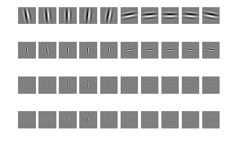


```python
# read the original figure
from skimage.color import rgb2gray
from scipy.signal import convolve2d
zebra = rgb2gray(plt.imread('data/gabor/Zebra_running_Ngorongoro.jpg'))

# filter with gabor banks
sinHorizontal = [];
sinVertical = [];
cosHorizontal = [];
cosVertical = [];
epsilon = 0.01 * step;
for sinGabor, gaborParam in zip(sinFilterBank, gaborParams):
    res = convolve2d(zebra, sinGabor, mode='valid')
    if abs(gaborParam['theta'] - 0) < 2*step + epsilon:
        sinVertical.append(res)
    else:
        sinHorizontal.append(res)
for cosGabor, gaborParam in zip(cosFilterBank, gaborParams):
    res = convolve2d(zebra, cosGabor, mode='valid')
    if abs(gaborParam['theta'] - 0) < 2*step + epsilon:
        cosVertical.append(res)
    else:
        cosHorizontal.append(res)
```


```python
resHorizontal = np.zeros(sinHorizontal[0].shape)
resVertical = np.zeros(sinVertical[0].shape)
```


```python
# plot the original figure
plt.figure(); myimshow(zebra)
plt.suptitle("Original Figure")

for res in sinHorizontal + cosHorizontal:
    resHorizontal = resHorizontal + res;
for res in sinVertical + cosVertical:
    resVertical = resVertical + res;

plt.figure(); myimshow(resHorizontal); 
plt.suptitle("horizontal strips");

plt.figure(); myimshow(resVertical); 
plt.suptitle("vertical strips");
plt.figure(); myimshow(resHorizontal + resVertical); 
plt.suptitle("horizontal and vertical strips");
```


    <matplotlib.figure.Figure at 0x112c06f50>


    <matplotlib.figure.Figure at 0x1139ff2d0>


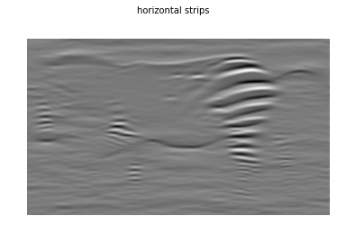


    <matplotlib.figure.Figure at 0x11ff2e3d0>


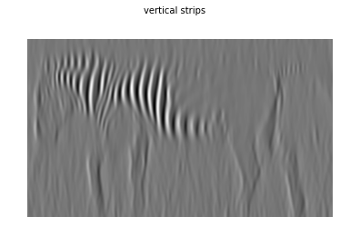


    <matplotlib.figure.Figure at 0x11ff4fc10>


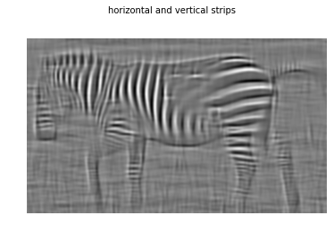


## b) get the leg


```python
# generate horizontal and vertical gabor bank
step = np.pi / 180 * 5;
# pick the +/- 10 degrees around vertial and horizontal orientation 
thetaLeg = np.linspace(0 - 8 * step, 0+8*step, 8)
theta = thetaLeg
omega = np.arange(0.1, 0.4, 0.1) # range of omega
params = [(t,o) for o in omega for t in theta]
sinFilterBank = []
cosFilterBank = []
gaborParams = []
for (theta, omega) in params:
    gaborParam = {'omega':omega, 'theta':theta, 'sz':(128, 128)}
    sinGabor = genGabor(func=np.sin, **gaborParam)
    cosGabor = genGabor(func=np.cos, **gaborParam)
    sinFilterBank.append(sinGabor)
    cosFilterBank.append(cosGabor)
    gaborParams.append(gaborParam)

plt.figure()
n = len(sinFilterBank)
for i in range(n):
    plt.subplot(4,8,i+1)
    plt.axis('off'); plt.imshow(sinFilterBank[i])

plt.figure()
for i in range(n):
    plt.subplot(4,8,i+1)
    plt.axis('off'); plt.imshow(cosFilterBank[i])
```


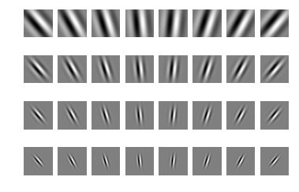


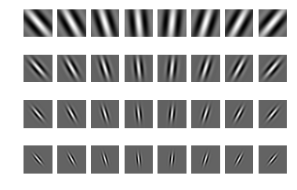


```python
# read the original figure
from skimage.color import rgb2gray
from scipy.signal import convolve2d
zebra = rgb2gray(plt.imread('data/gabor/Zebra_running_Ngorongoro.jpg'))

# filter with gabor banks
sinLeg = [];
cosLeg = [];
for sinGabor, gaborParam in zip(sinFilterBank, gaborParams):
    #%time res = convolve2d(zebra, sinGabor, mode='valid')
    res = convolve2d(zebra, sinGabor, mode='valid')
    sinLeg.append(res)
for cosGabor, gaborParam in zip(cosFilterBank, gaborParams):
    #%time res = convolve2d(zebra, cosGabor, mode='valid')
    res = convolve2d(zebra, cosGabor, mode='valid')
    cosLeg.append(res)

```


```python
# result of Leg filter
resLeg = np.zeros(sinLeg[0].shape)
# plot the original figure
plt.figure(); myimshow(zebra)
plt.suptitle("Original Figure")

for res in sinLeg + cosLeg:
    resLeg = resLeg + res;
    
plt.figure(); myimshow(resLeg); 
plt.suptitle("Get Horse Leg");


```


    <matplotlib.figure.Figure at 0x126a33550>


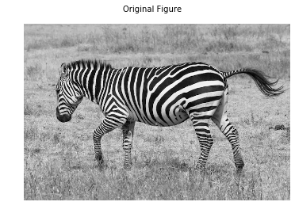


    <matplotlib.figure.Figure at 0x11473b710>


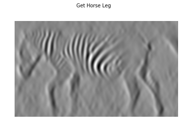


# Homework 1.2: Find parameter of an unknown gabor filter
Find the tuning curve of an idealized neuron by measuring its response to different sinusoids. The neuron is a Gabor function so you need to find its preferred orientation and phase. Use equations from _Slide: [SimpleCellsVisualCortex](http://www.stat.ucla.edu/~yuille/courses/Stat271-Fall15/SimpleCellsVisualCortex.pdf) - The Tuning of Gabor Filters _ if you want.

# Solution 1.2


```python
import pickle
# The parameter of this gabor(cell) is unknown
# Try to find its parameter:
unknownGabor = pickle.load(open('data/gabor/unknownGabor.data', 'rb'))
plt.figure(); myimshow(unknownGabor)

# You can use sinusoid as a stimuli
# For example:
rhos = np.linspace(0, np.pi/2, 8) #eight different phase
omegas = np.arange(0.4, 1.2, 0.2) #five spatial frequence
step = np.pi/180*5
thetaGuess = np.pi/180*30
thetas = np.arange(thetaGuess - 2 * step, thetaGuess + 2 * step, step) 

rhoBest = 0;
omegaBest = 0;
thetaBest = 0;

#first find the best theta
responsMax = 0.0;
for theta in thetas:
    rho = np.mean(rhos)
    omega = np.mean(omega)
    sinusoid = genSinusoid(unknownGabor.shape, 1, 
                           (omega*np.cos(theta), omega*np.sin(theta)), rho)
    response = convolve2d(sinusoid, unknownGabor, mode='valid')
    if response > responsMax:
        thetaBest = theta
        responsMax = response
#then find the best omega
responsMax = 0.0;
for omega in omegas:
    rho = np.mean(rhos)
    theta = thetaBest
    sinusoid = genSinusoid(unknownGabor.shape, 1, 
                           (omega*np.cos(theta), omega*np.sin(theta)), rho)
    response = convolve2d(sinusoid, unknownGabor, mode='valid')
    if response > responsMax:
        omegaBest = omega
        responsMax = response
#last find the best rho
responsMax = 0.0;
for rho in rhos:
    omega = omegaBest
    theta = thetaBest
    sinusoid = genSinusoid(unknownGabor.shape, 1, 
                           (omega*np.cos(theta), omega*np.sin(theta)), rho)
    response = convolve2d(sinusoid, unknownGabor, mode='valid')
    if response > responsMax:
        rhoBest = rho
        responsMax = response

sinusoidBest = genSinusoid(unknownGabor.shape, 1,
                           (omegaBest*np.cos(thetaBest), omegaBest*np.sin(thetaBest)), rhoBest)
plt.figure(); 
myimshow(sinusoidBest); 
gaborParamBest = {"theta":thetaBest, 
                  "thetaDeg": thetaBest/np.pi*180, 
                  "omega":omegaBest, 
                  "rho":rhoBest};
plt.title(r'$\theta$={theta:.2f}rad/{thetaDeg:.2f}deg $\omega$={omega}$ \rho$={rho}'.format(**gaborParamBest))
```


    <matplotlib.text.Text at 0x11c2840d0>


    <matplotlib.figure.Figure at 0x119624690>


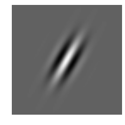


    <matplotlib.figure.Figure at 0x114981fd0>


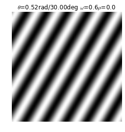


## Summary of solution 1.2

The result above show that the parameters are the unknown Gabor: 
$\theta = 30 \text{degs}, \omega = 0.6, \rho = 0$

# Homework 1.3  Find the parameter of Laplacian of Gaussian

1. Briefly describe in words what is a quadrature pair and the difference between simple and complex cells.
2. Find the parameter $\sigma$ of a Laplacian of Gaussian filter by measuring its response to different sinusoids.  
Use equation in _[LinearModelsSimpleCells](http://www.stat.ucla.edu/~yuille/courses/Stat271-Fall15/LinearModelsSimpleCells%281%29.pdf) - The Response of a Center-Surround Cell to sinusoids_ if you want.

# Solution 1.3

### a) Briefly describe in words what is a quadrature pair and the difference between simple and complex cells.

- quadrature pair
    - a quadrature pair is a pair of functions (sin and cos functions) whose magnitude, spatial frequence, and orientation are the same, but whose phase are orthgonal. That is, there is a 90 degree differences in the phase of these two functions.
    - when summing up the square response of this pair, the response is only sensitive to the 2D orientation but not sensitive to phase.
- difference between simple and complex cells
    - Simple cell is sensitive to specific orientation, specific spatial frequency, specific phase, and specific location in the space.
    - Complex cell is only sensitive to specific orientation and spatial frequency, it is spatial invariant, meaning that it is less sensitive to specific location in the space.

### b) see the code below

from the slide we know $\hat{\sigma} = \frac{2}{\hat{\omega}}$ (looks like there could be some problem in the slides deduction, the formula here provides a correct answer to parameter estimation)


```python
def getLoG(X, Y, sigma):
    Z = 1/(np.sqrt(2.0 * np.pi) * sigma) * np.exp(-(X**2+Y**2)/(2.0*sigma**2))
    dx = np.roll(Z, 1, axis=1) - Z
    dx2 = np.roll(dx, 1, axis=1) - dx
    dy = np.roll(Z, 1, axis=0) - Z
    dy2 = np.roll(dy, 1, axis=0) - dy
    LoG = -(dx2+dy2)
    return LoG

def getLoss(image, template):
    residule = image - template;
    residule = residule ** 2;
    sumSqaure = np.sum(np.sum(residule, axis = 0));
    return sumSqaure;

# Utility function to plot 3D surface
def surf(X, Y, Z, **kargs): 
    # Plot 3D data as surface, similar to surf(X,Y,Z) of http://www.mathworks.com/help/matlab/ref/surf.html
    from mpl_toolkits.mplot3d import Axes3D
    fig = plt.figure()
    ax = fig.add_subplot(111, projection='3d')
    ax.plot_surface(X, Y, Z, **kargs)
    
```


```python
# use convolution to sinusoid function
import pickle
from scipy.signal import convolve2d

unknownLoG = pickle.load(open('data/gabor/unknownLoG.data', 'rb'))
[X, Y] = np.meshgrid(np.arange(-100, 101), np.arange(-100, 101))

rho = np.pi/2
theta = np.pi/2
omegas = np.arange(0.05, 1, 0.05)
responseMax = 0;
for omega in omegas:
    sinusoid = genSinusoid(unknownLoG.shape, 1, (omega*np.cos(theta), omega*np.sin(theta)), rho)
    response = convolve2d(sinusoid, unknownLoG, mode='valid')
    if response > responseMax:
        responseMax = response
        omegaBest = omega
sigmaBest = 2/omegaBest
LoGBest = getLoG(X,Y,sigmaBest);

plt.figure(); myimshow(unknownLoG);plt.title('Unknown LoG')
plt.figure(); myimshow(LoGBest);plt.title(r'$\sigma$={:.2f}'.format(sigmaBest))
plt.figure(); surf(X, Y, unknownLoG, alpha=0.3); plt.title('Unknown LoG')
plt.figure(); surf(X, Y, LoGBest, alpha=0.3); plt.title(r'$\sigma$={:.2f}'.format(sigmaBest))
    

```


    <matplotlib.text.Text at 0x116645c50>


    <matplotlib.figure.Figure at 0x110372410>


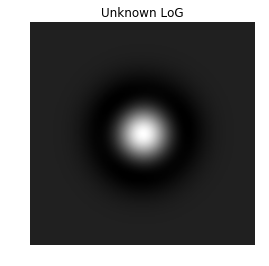


    <matplotlib.figure.Figure at 0x112c44350>


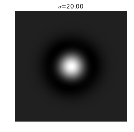


    <matplotlib.figure.Figure at 0x11945c0d0>


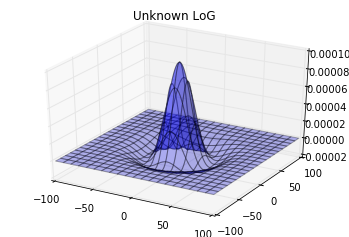


    <matplotlib.figure.Figure at 0x11945c890>


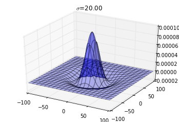


```python
print omegaBest
sinusoid = genSinusoid(unknownLoG.shape, 1, (omegaBest*np.cos(theta), omegaBest*np.sin(theta)), rho)
myimshow(sinusoid); 
```

    0.1


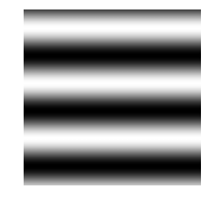


```python
# Generate LoGs with different sigma and calculate the difference
import pickle
from scipy.signal import correlate

unknownLoG = pickle.load(open('data/gabor/unknownLoG.data', 'rb'))
[X, Y] = np.meshgrid(np.arange(-100, 101), np.arange(-100, 101))

sigmas = np.arange(1,50,1);

lossMin = 1e16;
sigmaBest = 0;
for sigma in sigmas:
    LoG = getLoG(X,Y,sigma);
    loss = getLoss(unknownLoG, LoG)
    if loss < lossMin:
        lossMin = loss;
        sigmaBest = sigma;

LoGBest = getLoG(X,Y,sigmaBest);
plt.figure(); myimshow(unknownLoG);plt.title('Unknown LoG')
plt.figure(); myimshow(LoGBest);plt.title(r'$\sigma$={:.2f}'.format(sigmaBest))
plt.figure(); surf(X, Y, unknownLoG, alpha=0.3); plt.title('Unknown LoG')
plt.figure(); surf(X, Y, LoGBest, alpha=0.3); plt.title(r'$\sigma$={:.2f}'.format(sigmaBest))
```


    <matplotlib.text.Text at 0x118450910>


    <matplotlib.figure.Figure at 0x117e44750>


    <matplotlib.figure.Figure at 0x117e445d0>


    <matplotlib.figure.Figure at 0x11bb7e890>


    <matplotlib.figure.Figure at 0x116540150>


## Summary of solution 1.3

The result above show that the parameters are the unknown LoG: 
$\sigma = 20$
